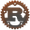

I am a master student of computer science at the University of Helsinki.
My primary focus is on iOS apps and full stack web applications,
and I tinker with DevOps and distributed computing.
In 2021 I won Apple's Swift Student Challenge coding competition.

Main languages: 
 
 
 

